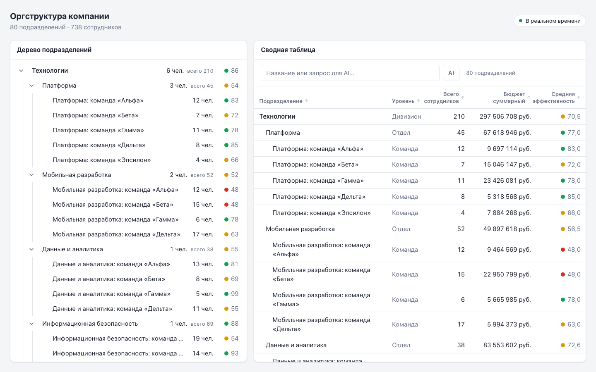
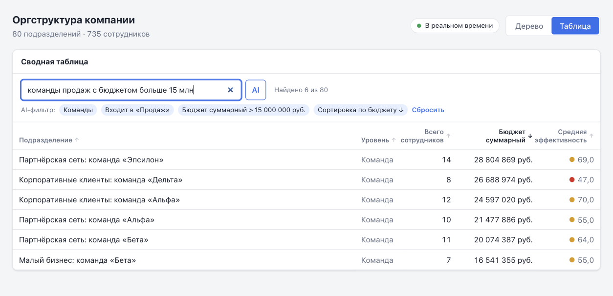
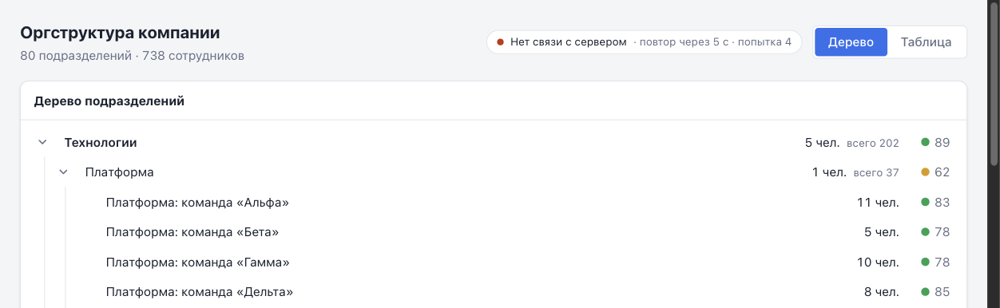
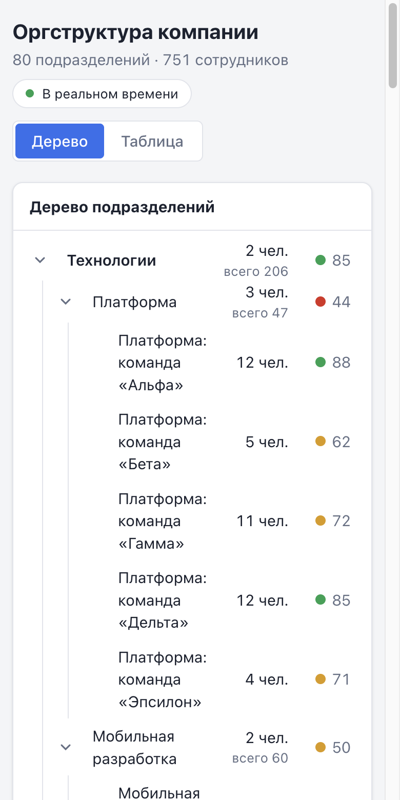

# Дашборд оргструктуры

Мониторинг иерархии компании «дивизионы → отделы → команды»: интерактивное дерево и сводная таблица с суммарными показателями по поддеревьям, обновляемые в реальном времени, и AI-поиск на естественном языке. Стек — React 19, Vite 8, TypeScript, styled-components, TanStack Query, zod; собственный mock-сервер на Node 24.

> Работа шла по этапам, каждый этап — отдельный коммит с тегом `step/1` … `step/4`.



## Запуск одной командой

Нужен Docker с Compose v2.

```bash
docker compose up --build
```

Откройте http://localhost:8080. `.env` не обязателен: без него используются значения по умолчанию, а AI-поиск выключен (работает поиск по названию). Чтобы включить AI или сменить порты, скопируйте `.env.example` в `.env`. Порт по умолчанию доступен только с этой машины; открыть в сеть — `CLIENT_BIND=0.0.0.0`.

| Переменная | По умолчанию | Назначение |
| --- | --- | --- |
| `CLIENT_PORT` | `8080` | порт nginx на хосте |
| `CLIENT_BIND` | `127.0.0.1` | адрес, на котором публикуется порт; `0.0.0.0` — доступ из сети |
| `SERVER_PORT` | `3001` | порт API-сервера (внутри сети compose; в dev — порт для прокси Vite) |
| `SIM_MIN_INTERVAL_MS` / `SIM_MAX_INTERVAL_MS` | `1500` / `4000` | интервал между изменениями данных |
| `AI_BASE_URL` | `https://api.openai.com/v1` | любой OpenAI-совместимый API с `response_format: json_schema` |
| `AI_API_KEY`, `AI_MODEL` | — | без них AI-поиск выключен; ключ остаётся на сервере |
| `AI_TIMEOUT_MS` | `8000` | таймаут запроса к AI-провайдеру |
| `AI_MAX_CONCURRENT` / `AI_RATE_LIMIT_PER_MINUTE` | `4` / `30` | общие лимиты запросов к провайдеру; сверх них — 429 и поиск по названию |

## Разработка

Нужен Node.js 24+.

```bash
npm install
npm run dev
```

`npm run dev` поднимает сервер (`http://localhost:3001`) и клиент (`http://localhost:5173`). `/api`, включая WebSocket `/api/live`, проксируется на сервер. Оба процесса читают `.env` в корне: сервер берёт из него все настройки, Vite — `SERVER_PORT` для прокси, поэтому нестандартный порт достаточно указать один раз.

| Команда | Что делает |
| --- | --- |
| `npm run dev` | сервер + клиент в режиме разработки |
| `npm test` | unit- и интеграционные тесты (vitest; серверные тесты поднимают HTTP/WebSocket на свободном порту) |
| `npm run typecheck` | проверка типов клиента, сервера и конфигов |
| `npm run lint` | oxlint |
| `npm run build` | проверка типов и production-сборка клиента |
| `npm run size` | бюджет бандла: сумма gzip JS и CSS ≤ 200 КБ |
| `npm run compress` | предварительное gzip-сжатие статики для nginx |

### Проверка состояний

Параметр `?scenario=` в адресе страницы пробрасывается в API:

| Адрес | Состояние |
| --- | --- |
| `/?scenario=slow` | загрузка (ответ через 3 с) |
| `/?scenario=error` | ошибка сервера (500, после двух повторов) |
| `/?scenario=invalid` | ответ не проходит валидацию схемы |
| `/?scenario=empty` | пустой массив |

В демо-сценариях live-обновления выключены: ответ сценария не несёт версии, патчи к нему неприменимы.

### Проверка live-обновлений

- Данные меняются каждые 1,5–4 с. Изменённые ячейки и суммы предков подсвечиваются, в Network нет запросов `/api/org-tree`.
- Если остановить сервер, индикатор покажет «Нет связи с сервером» с отсчётом, интервалы растут до 30 с. После запуска сервера клиент делает ровно один запрос снимка и возвращается в «В реальном времени».
- Эмуляция offline в DevTools: индикатор «Нет сети», при возвращении сети — мгновенное переподключение.

### Проверка AI-поиска

- Без ключа: во вкладке таблицы введите запрос и нажмите Enter — подсказка «AI-поиск не настроен… показан поиск по названию».
- С ключом (`AI_API_KEY`, `AI_MODEL` в `.env`): «команды продаж с бюджетом больше 15 млн», «топ-5 отделов по численности», «дивизионы с эффективностью ниже 70». Условия фильтра показываются чипами под полем.

## Что реализовано

### Этап 1 — Foundation

- Vite + React + TypeScript, абсолютные импорты `@/…` и `@shared/…`.
- Mock-сервер: `GET /api/org-tree` возвращает 80 узлов в три уровня; ETag и версия состояния `(epoch, revision)`, 304 на неизменённые данные.
- Схема ответа валидируется zod; невалидный ответ или битая иерархия (дубликаты, несуществующий родитель, цикл) — ошибка.
- TanStack Query: stale time 5 с, дедупликация, отмена при размонтировании, условные запросы — на 304 возвращается готовая модель без повторной агрегации.
- Дерево: раскрытие и скрытие ветвей, по умолчанию раскрыты дивизионы и отделы (второй уровень). Узел показывает название, численность и цветовой индикатор эффективности с числом.
- Состояния загрузки, ошибки (с повтором), пустого ответа и неудачного фонового обновления. Стили только через styled-components.

### Этап 2 — Core

- От 1280px дерево и таблица стоят рядом, каждая панель прокручивается независимо. На узких экранах — переключатель «Дерево / Таблица», рендерится только активная панель.
- Таблица: Подразделение, Уровень, Всего сотрудников, Бюджет суммарный, Средняя эффективность. Суммы включают узел и всех потомков, средняя эффективность взвешена по численности; у подразделения без сотрудников — «—».
- Сортировка по любому столбцу: клик — по возрастанию, двойной клик — по убыванию (с клавиатуры Enter / Shift+Enter).
- Поиск по названию в реальном времени с debounce 250 мс; без учёта регистра и различий «е/ё». Отдельное состояние «Ничего не найдено» с кнопкой сброса.
- Клик по строке выбирает узел в дереве: раскрывает свёрнутых предков, подсвечивает узел и прокручивает к нему.
- Бюджеты в формате `12 345 678 руб.` с неразрывными пробелами.
- Агрегаты считаются один раз на версию данных и берутся таблицей из кэша. Строки, сортировка и фильтр мемоизированы по отдельности.
- В дереве у узлов с потомками рядом с численностью приглушённо показано «всего N».

### Этап 3 — Polish

- Realtime через WebSocket: сервер меняет 1–3 узла каждые 1,5–4 с и рассылает патчи с номером ревизии.
- Клиент применяет патчи без рефетча и пересчитывает агрегаты только изменённого узла и его предков. Подсветка обновлённых ячеек гаснет за 1,5 с.
- Пропуск патча, рестарт сервера или неприменимый патч — автоматическая синхронизация одним запросом снимка.
- Индикатор соединения в шапке: «В реальном времени», «Синхронизация…», «Нет связи · повтор через N с», «Нет сети».
- Экспоненциальный backoff 1 → 2 → 4 … 30 с с jitter. Мгновенное переподключение при возвращении сети, таймаут установки соединения — 10 с, «зависшего» соединения — 45 с.
- Пока идут live-обновления, фокус окна и повторное монтирование не делают HTTP-запросов.
- Таблица с клавиатуры: ↑/↓, Home/End, Enter выбирает узел в дереве (roving tabindex, активная строка не сбивается сортировкой, фильтром и патчами).
- Анимация раскрытия дерева через transition `height`; при `prefers-reduced-motion` раскрытие мгновенное.

### Этап 4 — Bonus

- `docker compose up --build` поднимает сервер и nginx с клиентом; конфигурация через `.env` со значениями по умолчанию.
- nginx: прокси API и WebSocket, статика с предварительным gzip (`gzip_static`), долгий кэш для хэшированных файлов, SPA fallback.
- Бюджет бандла проверяется при сборке образа: сейчас около 126 КБ gzip из 200.
- AI-поиск: Enter или кнопка «AI» отправляют запрос на сервер. Сервер получает от OpenAI-совместимой модели структурированный фильтр (strict JSON Schema), проверяет его и возвращает клиенту. Фильтр по уровню, предку, названию, суммарным и собственным метрикам, сортировка и «топ-N».
- Расход ключа ограничен: сервер держит общий лимит частоты и параллельных запросов к провайдеру, nginx — лимит по IP, порт по умолчанию слушает только `127.0.0.1`.
- Ошибка, таймаут, превышение лимита, отсутствие ключа или некорректный ответ модели — подсказка и поиск по названию. Повтор того же запроса 30 минут берётся из кэша.

## Скриншоты

Дерево и таблица рядом — в начале README.

| AI-поиск | Нет связи с сервером | Телефон |
| --- | --- | --- |
|  |  |  |

Скриншот AI-поиска снят с mock-провайдером, совместимым с OpenAI (см. «AI в разработке»): он показывает интерфейс и путь запроса, а не качество разбора реальной моделью.

## Документация

- [Архитектура](docs/architecture.md) — слои, поток данных от API до UI
- [Модель данных](docs/data-model.md) — контракт, дерево, алгоритм агрегации
- ADR: [001 TanStack Query](docs/adr/001-tanstack-query-cache.md) · [002 валидация zod](docs/adr/002-runtime-validation-zod.md) · [003 модель и версия в кэше](docs/adr/003-derived-model-in-query-cache.md) · [004 WebSocket и ревизии](docs/adr/004-websocket-revisioned-patches.md) · [005 инкрементальная агрегация](docs/adr/005-incremental-aggregation.md) · [006 AI-поиск](docs/adr/006-ai-search-structured-filter.md) · [007 Docker и nginx](docs/adr/007-nginx-docker-delivery.md)

## AI в разработке

### Инструменты

Claude Code (модель Claude Opus 5) в терминале: планирование, генерация кода, тестов и документации, проверка в браузере через Claude in Chrome, сборка и проверка Docker-образов. Документация библиотек (TanStack Query, ws, OpenAI structured outputs) сверялась через Context7.

### Что генерировалось

- **План работ.** Claude Code составил план по четырём этапам. План прошёл два внешних ревью, по их итогам в него внесены изменения (см. ниже).
- **Этап 1:** сервер и генератор данных, zod-схема, построение индекса и агрегация, слой запросов, компоненты дерева и состояний, тема, unit-тесты, документация и ADR.
- **Этап 2:** таблица с сортировкой и поиском, модель строк, поднятое состояние дерева и выбор узла, split-view и переключатель вида, форматирование, unit- и интеграционные тесты (сортировка, дебаунс, выбор строки → узел в дереве, сохранение состояния при переключении вкладок), документация.
- **Этап 3:** WebSocket-сервер и симулятор, `LiveClient`, `SyncController`, `applyPatch`, подсветка, `Collapse`, клавиатурная навигация, индикатор; тесты (property-тест агрегации, сценарии resync, backoff и таймеры, сервер через настоящий WebSocket), ADR 004–005.
- **Этап 4:** Dockerfile сервера и клиента, compose, шаблон nginx, скрипты бюджета и сжатия, AI-поиск (эндпоинт, промпт и JSON Schema, нормализация ответа модели, клиентский запрос, применение фильтра, чипы), тесты (поддельный OpenAI-совместимый сервер: таймаут, отмена при уходе клиента, ошибки; сценарии UI: кэш, отмена, запоздалый ответ, fallback), скриншоты, ADR 006–007.
- **Проверка тестов.** На ключевой логике делалась мутационная проверка: код намеренно ломали (отключали проверку разрыва ревизий, обход предков, push-режим `staleTime`, сброс backoff, фильтр старого epoch, подсветку первого рендера) и убеждались, что тесты падают.

### Что изменилось после ревью плана и почему

Первоначальный план был пересмотрен до начала реализации:

| Было в плане | Стало | Почему |
| --- | --- | --- |
| Версия данных — только `revision` | Пара `(epoch, revision)` | После рестарта сервера номер ревизии повторяется для других данных: возможны ложный 304 и пропущенная синхронизация |
| Браузер сам делает условный запрос (`no-cache` + ETag) | Клиент сам отправляет `If-None-Match` с `cache: 'no-store'` | Браузер отдаёт JS 200 вместо 304, и модель пересобиралась бы и переагрегировалась |
| Раскрыты только дивизионы | Раскрыты дивизионы и отделы | Буквальное прочтение «второй уровень открыт» |
| Отмена запроса проверяется переключением вида | Unit-тест с размонтированием всех потребителей | Пока жив хоть один потребитель, запрос не отменяется, и проверка ничего не доказывала |
| Буфер патчей только до первой загрузки; «рефетч только при разрыве» | Протокол resync с очередью, heartbeat, пакетный пересчёт агрегатов | Патчи во время запроса снимка терялись бы; «зависший» сокет не обнаруживался; пересчёт по одному патчу пересчитывал бы общих предков несколько раз |
| Рефетч по фокусу окна как обычно | `staleTime` — функция: `Infinity`, пока модель поддерживается патчами | Иначе каждый фокус окна делал бы HTTP-запрос при живом push-канале |

### Правки в ходе реализации этапа 1

- `role="tree"` из плана заменён на disclosure-паттерн: вложенные списки с кнопками `aria-expanded`. Полноценный ARIA tree требует клавиатурной навигации по узлам, которую ТЗ не требует; неполный tree хуже для скринридеров, чем корректный disclosure.
- Контракт в `shared/contract.ts` содержит не только типы, но и константы заголовков, поэтому серверный Docker-образ на этапе 4 должен копировать и `shared/`.

### Исправления по ревью кода этапа 1

- **Сервер падал от некорректного адреса запроса** (`GET //[`): `new URL` бросал исключение вне обработки. Теперь такой запрос получает 400, а непредвиденная ошибка обработчика — 500; процесс продолжает работать.
- **Обрыв соединения при чтении тела ответа считался «неверными данными»** и не повторялся. Чтение тела и разбор JSON разделены: обрыв — сетевая ошибка с повторами, отмена остаётся отменой, ошибкой данных считается только невалидный JSON.

Регрессионные тесты сначала запускались на прежнем коде и падали.

### Правки в ходе реализации этапа 2

Проверка в браузере нашла то, чего не было видно в unit-тестах (jsdom не считает раскладку):

- **Split-view не ограничивал высоту.** Строка grid растягивалась по содержимому, и вместо двух прокручиваемых панелей прокручивалась вся страница. Исправлено через `grid-template-rows: minmax(0, 1fr)`.
- **Скрытые подписи растягивали страницу.** Подписи для скринридеров (`position: absolute`) внутри контейнера с `overflow: auto` без позиционирования выходили за его пределы: документ получал высоту ~4700px при экране 900px. Контейнеры прокрутки получили `position: relative`.
- **Столбцы таблицы «прыгали»** при фильтрации и сортировке, а при ширине 1440px названия переносились в три строки. Сделаны фиксированные ширины числовых столбцов (`table-layout: fixed`), заголовки переносятся в две строки.

Уточнения относительно плана:

- Очистка поиска применяется сразу, без 250 мс ожидания; дебаунс нужен только при вводе.
- При сортировке по эффективности узлы без сотрудников всегда в конце, независимо от направления.
- Цвет индикатора считается от округлённого значения, чтобы «75,0» не горело жёлтым из-за 74,96.
- `aria-selected` у строк обычной таблицы невалиден (он для `grid`), поэтому выбор объявляется скрытой подписью «выбрано».

### Правки в ходе реализации этапа 3

Найдено при проверке в браузере (остановка и перезапуск сервера, клавиатура):

- **Backoff не выглядел экспоненциальным.** В плане был full jitter (задержка случайна в `[0, cap]`), и 8-я попытка случилась через 7 с. Переход на equal jitter (`[cap/2, cap]`) гарантирует рост интервалов и сохраняет разброс между клиентами. После исправления: 1, 2, 3, 5, 9, 19, 30 с.
- **Отсчёт в первом кадре показывал неверное число**: «повтор через 9 с», а через мгновение «1 с». Время компонента обновлялось после рендера. В статус добавлена выбранная задержка, отображаемый остаток ограничен ею.
- **Рамка фокуса строки обрезалась** на ячейках с подсветкой: они создают свой контекст наложения и перекрывают `outline` строки. Рамка перенесена на ячейки.
- **Стрелки считали шаг от «активной» строки, а не от сфокусированной**, если фокус поставлен мышью. Теперь шаг считается от строки с фокусом, а фокус делает её активной.

Уточнения относительно плана:

- **Пересоздание колбэков.** `toggle`/`select` зависели от модели и пересоздавались на каждом патче, что сбивало `memo` всех строк таблицы. Индекс теперь читается через ref.
- **Раскрытие при выборе строки не анимируется**: прокрутка к узлу считала бы позицию по ещё не раскрытым ветвям.
- **Очередь при переполнении** вытесняет старые патчи вместо отдельного флага: потерю ловит та же проверка разрыва ревизий.
- **Дерево на патч перерисовывает видимые узлы, таблица — только изменённые строки.** Точечная подписка узлов дерева не окупается на 80 узлах (ADR 005).

### Исправления по ревью кода этапа 3

- **Лишний resync на отстающие hello/heartbeat.** Если HTTP-снимок обогнал сообщения в сокете, heartbeat приходит с ревизией ниже модели. Код требовал точного равенства, запускал ещё один запрос снимка и приостанавливал применение патчей. Теперь ревизия не новее модели того же epoch считается синхронной, как и при разборе очереди.
- **Кража фокуса при live-обновлениях.** После клика по нефокусируемому месту страницы (`blur` с `relatedTarget = null`) таблица считала, что фокус всё ещё в строках. Следующий патч возвращал фокус в таблицу и мог прокрутить её. Теперь запоминается сфокусированная строка, любой уход фокуса из таблицы её сбрасывает, а фокус восстанавливается только если эта строка исчезла из выборки.

Для обоих дефектов сначала написаны тесты, которые падали на прежнем коде.

### Правки в ходе реализации этапа 4

- **Слабый ETag за nginx.** При проверке через Docker оказалось, что nginx при gzip-сжатии отдаёт `ETag: W/"…"`. Сервер сравнивал ETag строго, и клиент, возвращающий заголовок как есть, не получил бы 304. Сравнение стало слабым по RFC 9110, добавлен тест.
- **Вёрстка на телефоне.** Скриншот на 390px показал, что в дереве от названий остаётся «Платфо…». Названия теперь переносятся целиком по словам, «всего N» уходит второй строкой.
- **Ложная тревога на скриншоте.** Headless Chrome обрезал страницу шириной 390px (у него минимальная ширина окна больше), и казалось, что контент шире экрана. Замер в iframe нужной ширины показал, что переполнения нет; мобильный скриншот снят через iframe.
- **Уточнения относительно плана:**
  - `env_file` с `required: false` заменён интерполяцией `${VAR:-default}`: одно место для переменных, `.env` compose читает сам (ADR 007);
  - у `AI_MODEL` нет значения по умолчанию: без явной модели AI выключен, а не падает на несуществующем имени;
  - пустой фильтр от модели (запрос не про оргструктуру) даёт подсказку и текстовый поиск, а не «все строки»;
  - AI-поиск находится внутри фичи таблицы, а не отдельной фичей: фичи не импортируют друг друга.
- **Как проверялся AI.** Реального ключа в окружении разработки не было. Серверная часть покрыта тестами с поддельным OpenAI-совместимым сервером. Вручную путь «браузер → nginx → сервер → провайдер» проверен с локальным mock-провайдером, который по ключевым словам возвращает фильтр в формате модели (не входит в репозиторий). Проверены 200, 502 на фильтр не по схеме, 504 через 8 с и передача ключа и strict-схемы. Качество разбора запросов реальной моделью не проверялось.

### Исправления по ревью кода этапа 4

- **Нестандартный порт из `.env` ломал dev-режим.** Сервер читал `SERVER_PORT` из `.env`, а прокси Vite брал порт только из окружения процесса и продолжал ходить на 3001: API и live-обновления переставали работать. `vite.config.ts` теперь загружает `SERVER_`-переменные из того же `.env` через `loadEnv`. Переменная окружения процесса по-прежнему важнее файла, как у сервера. Проверено вживую на копии проекта с `SERVER_PORT=3055`: до исправления прокси отвечал epoch чужого сервера на 3001, после — сервера на 3055.
- **Упавший AI-поиск нельзя было повторить, не меняя ввод.** Повторная отправка ставила тот же ключ запроса, и TanStack Query ничего не запрашивал: после сетевого сбоя или таймаута провайдера поиск оставался в режиме подсказки. Теперь повторная отправка того же ввода после ошибки делает новый запрос, а успешный результат по-прежнему берётся из кэша. Тест на повтор после сбоя падал на прежнем коде, тест на кэш после успеха проходит в обоих вариантах.

### Исправления по аудиту проекта

После этапа 4 проведён отдельный аудит всего проекта: безопасность API, обработка ошибок, синхронизация, Docker и документация. Все три замечания подтвердились. На каждое сначала написан тест, который падал на прежнем коде.

- **AI-поиск не ограничивал расход ключа.** Любой клиент с доступом к порту мог без ограничений вызывать платного провайдера, а compose публиковал порт на всех интерфейсах. Сервер теперь держит общий для всех клиентов лимит: 4 одновременных запроса и 30 в минуту (`AI_MAX_CONCURRENT`, `AI_RATE_LIMIT_PER_MINUTE`). Сверх лимита — 429 с `Retry-After`, провайдер не вызывается. nginx дополнительно ограничивает AI-поиск 10 запросами в минуту с одного IP и отвечает тем же JSON. Порт по умолчанию публикуется только на `127.0.0.1` (`CLIENT_BIND`). Клиент на 429 показывает подсказку и поиск по названию. Авторизацию не добавлял: в демо нет пользователей, это описано в ADR 006 как условие реального размещения. Проверено в Docker: из быстрой серии запросов с одного адреса первые 6 проходят (всплеск 5 плюс один), дальше nginx отвечает 429 в формате ошибок AI-поиска; `docker ps` показывает порт как `127.0.0.1:…->80`; WebSocket через nginx работает.
- **Зависшая установка WebSocket-соединения не ограничивалась по времени.** Таймер тишины запускался только после `open`, и сокет без `open` и `close` держал клиент в «Подключение…» до сетевого таймаута браузера. Теперь, если `open` не пришёл за 10 с, `LiveClient` закрывает сокет и переходит к обычному backoff. Исправление вошло в коммит этапа 3.
- **Ответ провайдера `null` давал 500 вместо 502.** Сервер обращался к `completion.choices` без проверки, и JSON `null` бросал `TypeError` — ответ выходил за контракт ошибок AI-поиска. Оболочка ответа теперь проверяется как недоверенные данные: `null`, массив, строка или `choices` без `message` дают 502 `invalid_model_output`.

### Ручные правки

Ручных правок кода не было: код, тесты, конфигурация и документация сгенерированы Claude Code. Роль автора:

- постановка задачи и решения на развилках: TanStack Query, OpenAI-совместимый API, коммит и тег на этап, пауза после каждого этапа, `amend` для исправлений по ревью;
- два внешних ревью плана;
- ревью кода этапов 1, 3 и 4 и аудит проекта после этапа 4. Найденные дефекты исправлялись Claude Code по замечаниям, с тестами или живой проверкой, воспроизводящими дефект.
